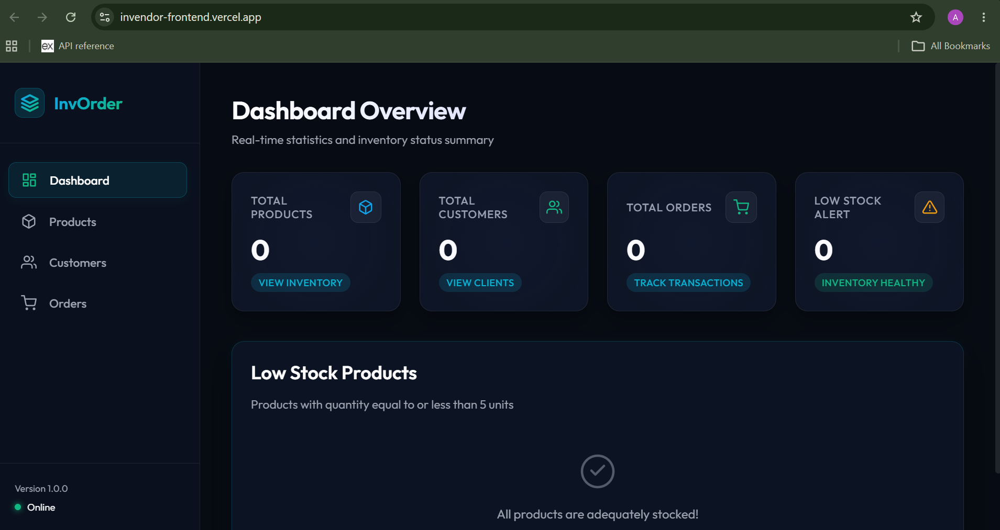
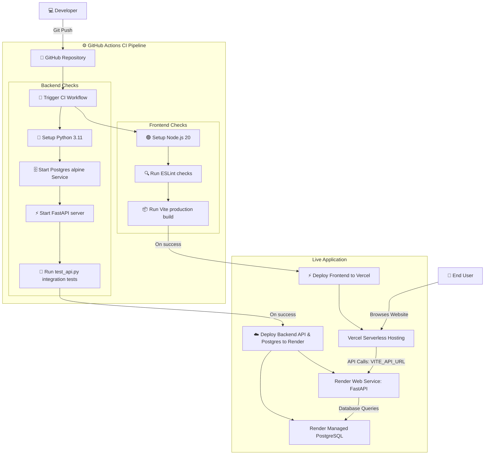
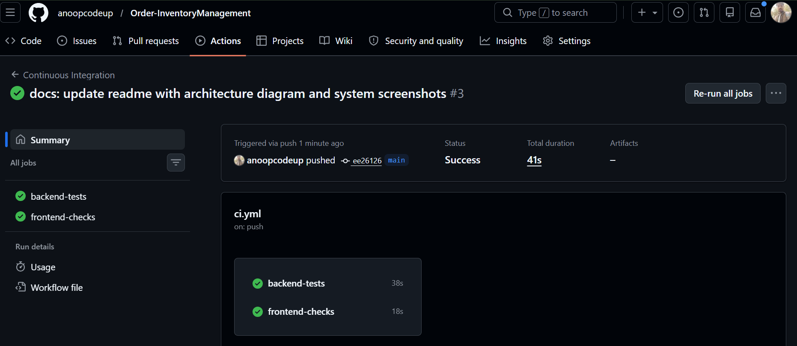
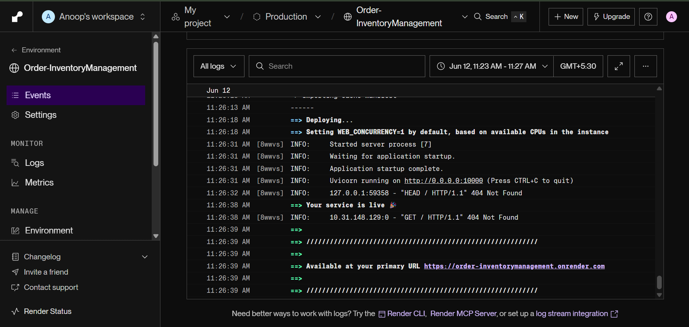
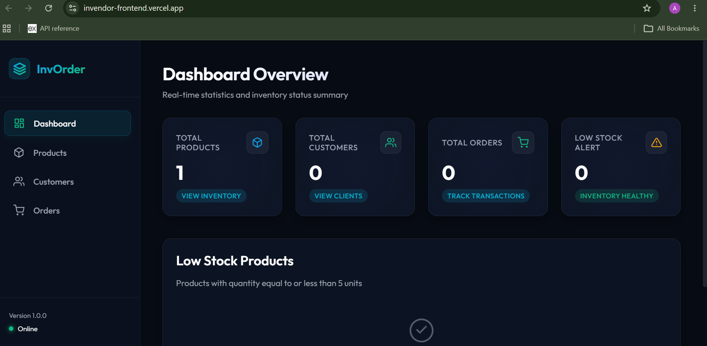

# 📦 InvOrder - Containerized Inventory & Order Management System

InvOrder is a production-ready, full-stack inventory and order tracking application designed with premium glassmorphic UI/UX aesthetics. The entire stack is containerized with Docker, verified via an automated GitHub Actions CI/CD pipeline, and deployed to Render (backend & PostgreSQL) and Vercel (frontend).

---

## 📸 System Preview

### 🖥️ Dashboard & Theme
The application features a responsive, glassmorphic "Ocean Cyan & Emerald Green" layout. All key business metrics are arranged horizontally on desktop viewports with responsive adaptations for tablet and mobile devices:



---

## 🛠️ Technology Stack

- **Frontend**: React (Vite) styled with a custom Vanilla CSS glassmorphic theme (responsive flex structures, custom transitions, Indian Rupee localization).
- **Backend API**: Python FastAPI utilizing asynchronous lifespans, SQLAlchemy ORM, and Pydantic input schemas.
- **Database**: PostgreSQL with strict integrity constraints (e.g. database-level `RESTRICT` triggers to prevent unsafe cascade deletions).
- **Orchestration**: Docker Compose for concurrent multi-container builds and startup sequencing.
- **CI/CD Pipeline**: GitHub Actions for automated unit testing (using a live PostgreSQL service container) and strict ESLint compliance checks.

---

## ⚙️ System Architecture & Workflow

Here is how the continuous integration, continuous deployment, and runtime hosting architecture flow together:



---

## 🚀 Getting Started

### Prerequisites
- [Docker](https://www.docker.com/) and [Docker Compose](https://docs.docker.com/compose/) installed locally.
- Python 3.11+ (if running tests locally outside of containers).

### Local Configuration
Ensure a `.env` file exists in the root folder containing database and API connectivity values:
```env
# PostgreSQL Database Settings
POSTGRES_USER=<your_database_username>
POSTGRES_PASSWORD=<your_database_password>
POSTGRES_DB=<your_database_name>

# Backend API Database Connector
DATABASE_URL=postgresql://<your_database_username>:<your_database_password>@db:5432/<your_database_name>
```

### Running the System
Build and start all services concurrently in background mode:
```bash
docker compose up --build -d
```

Once successfully started, access the local environments:
- 💻 **React Frontend**: [http://localhost:3000](http://localhost:3000)
- ⚡ **FastAPI Interactive Swagger Docs**: [http://localhost:8000/docs](http://localhost:8000/docs)
- 🗄️ **PostgreSQL Port Binding**: `localhost:5432`

To tear down the containers and preserve database volume data:
```bash
docker compose down
```
To reset and destroy the database volumes, add the `-v` flag: `docker compose down -v`.

---

## 🧪 Testing & CI Pipeline

We have implemented a comprehensive test suite in [test_api.py](file:///c:/Users/ANOOP%20SINGH/OneDrive/Desktop/Order&InventoryManagement/test_api.py) that covers critical business logic, edge cases, and integrity constraints:
- Input validation (rejecting negative prices or negative stock quantities).
- Unique constraint checks (preventing duplicate SKUs or duplicate customer emails).
- Transactional flows (stock reduction on orders, stock restoration on cancellations).
- Delete restrictions (blocking removal of customers or products linked to active orders).

With the containers running, you can run the test suite locally:
```bash
python test_api.py
```

GitHub Actions automatically runs these exact backend integration tests and runs strict ESLint quality validation on the React frontend components on every commit to `main`.



---

## 🌐 Production Deployment

### 1. Backend & Managed Database (Render)
The FastAPI backend and PostgreSQL database are hosted on Render. Render manages the Postgres instance and deploys the FastAPI container by reading the [Dockerfile](file:///c:/Users/ANOOP%20SINGH/OneDrive/Desktop/Order&InventoryManagement/backend/Dockerfile).



1. Connect your repository to Render.
2. Spin up a **managed PostgreSQL database**.
3. Create a **Web Service** for the backend, setting the root directory to `backend`.
4. Inject the environment variables:
   - `DATABASE_URL`: Your Render database connection string.

### 2. Frontend SPA (Vercel)
The React single-page application (SPA) is built and deployed serverless on Vercel, referencing rewrites defined in `vercel.json` to enable clean routing.



1. Connect your repository to Vercel and import the project.
2. Select **Vite** as the build configuration preset.
3. Configure the Root Directory to `frontend`.
4. Inject the following Environment Variable:
   - `VITE_API_URL`: Your live Render backend API endpoint.
